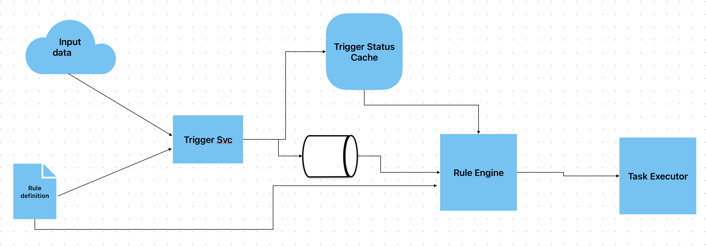

# Rules Engine Design

This document presents a proposal on how to design the rules engine for
GHS. The purpose of the rules is to automate tasks that would otherwise
be executed manually. An example rule might be something like "Execute
git gc in repo X when number of orphaned commits is above Y".

## Rule Characteristics
The rule can be either time-based (eg. "execute git gc every Sunday at
4pm", "delete X type of files from Y repo every day between 10am and 
11am"), or reactive to some ephemeral change to the system (eg. "run
a git-repack when disk size above X%"). Generally speaking, a rule needs
some sort of _input data_ which will use to evaluate a _trigger condition_
and execute an _action_ when the rule is _active_. Here are some
characteristics which are common to all rules:
- **Name**: so that it can be easily identified, also helps with auditing.
- **Description**: optional, helps the end user understand what purpose
the rule is trying to fulfil.
- **Enabled**: a boolean flag to indicate if the rule is enabled or not.
Disabled rules are not evaluated by the rule engine.
- **Trigger**: Under what conditions the rule is considered active, which
allows the rule engine to execute the rule action. A rule may have
multiple trigger conditions, and they are tied together using logical
operators. Moreover, the trigger should define the periodicity at which
the trigger condition will be evaluated. For example, a time-based rule 
would typically have a `Cron` or similar schedule, whereas a reactive
rule would typically have a `Tick` or similar schedule.
- **Action**: What task the rule engine should execute when the rule has
triggered. A rule may have multiple actions, and they are tied
together using logical operators. Examples of actions include executing
an OS command, call an API, log something etc.

## Input Sources
Theoretically the pool of input data sources is very large, but in the
interest of simplicity and given this is the first iteration, we can
assume that the relevant data is kept in memory in a form of a Hashmap
or similar data structure. This can grow organically in the future and
include other sources like a metrics registry, a kafka topic etc.
There could also be multiple data sources that a rule can tap into, but
for the first iteration we should consider just one input data source.

## DSL
The rule should be expressed with the help of an easy-to-understand DSL.
[HOCON](https://github.com/lightbend/config/blob/main/HOCON.md) is a 
great tool for this job, expressing the rule in config is easy to
understand, easy to create and easy to test. Specifying rules in
configuration files will also allow the rules to be defined externally.

Not every rule will be applicable for every repo; some repos are more
actively worked on, assume greater importance in a specific period of
time, have different sizes etc. As such, the suggestion here is to
configure a _set of rules per repo_.

For example, the below configuration _registers_ the `git-repack` rule
to the `example-repo`. This rule will run the git repack command every
time the repo disk size goes above 10GB. The trigger condition is
evaluated every 30 minutes. There is a single trigger condition hence
the `operator` is set to `None`. Other values could be logical operators
`AND`, `OR` etc. Note that the `rules` is a list, meaning we can register
multiple rules per repo.
```HOCON
{
  example-repo {
    path = "/path/to/repo"
    rules = [
      {
        type = git-repack
        name = git-repack-${repo-name}
        description = "Runs git-repack to free up disk space"
        enabled = true
        triggers = [{
          type = disk-size-above-threshold
          threshold = 10GB
          periodicity {
            type = tick
            interval = 30m
          }
          operator = None
        }]
        actions = [{
          type = run-git-repack-cmd
        }]
      }
    ]
  }
}
```

## High-level design
The main _entities_ in this design are the components responsible for
evaluating the trigger, processing the rule and executing the rule
actions. These entities need to be decoupled, with a clear separation
of concerns. They can communicate via work queues or other similar
data structure, rest apis etc. State can be stored in a cache, either
in-memory or persisted depending on the user's needs. Given the choices
for the underlying technology can vary, well-designed interfaces are
important. Multiple actions can be executed in parallel, but there
needs to be a parallelism threshold.

The trigger service parses the rule definitions config and evaluates the 
trigger condition for each rule, by consuming the input data and running
the trigger condition logic. If the condition is triggered, the rule
becomes active; A message is published to the Rule Engine queue, and the
Trigger Status Cache is updated. The queue is a FIFO type, although in
the future we might want to switch to a priority queue, as some tasks
might be more urgent than others. The cache is keyed by the rule name,
with the value being the trigger's active status. 

The Rule Engine picks up the messages sent by the Trigger Service via
its queue. It checks with the Trigger Status Cache if the trigger is
still active and async schedules the action with the Task Executor.



## Other considerations
**Auditing**: We need to be able to answer questions "When did rule X
trigger", "What caused rule X to execute", "How long it took for the
action to finish" etc.

**Sorting**: Time-based triggers might need to be chronologically
ordered.

**Rule chaining**: Rule chaining should be used with care, as it can
make the rules difficult to troubleshoot.

**Parallelism**: Parallelism allows multiple tasks to be executed in
parallel, but at this time it is unknown if this is ideal.
For example, it is not yet clear if two tasks might be overlapping, if
the result of one task execution might have a negative impact on the
other task, or even if executing one task makes the other redundant.
The parallelism threshold addresses this issue.

**Trigger Reset**: There could be cases where the trigger service
resets the trigger (eg for time based triggers), but there might
be use cases where the Rules Engine will also need to reset the
trigger after task execution.

**Fault tolerance**: We generally accept that tasks will be executed
in a best-effort basis. 
